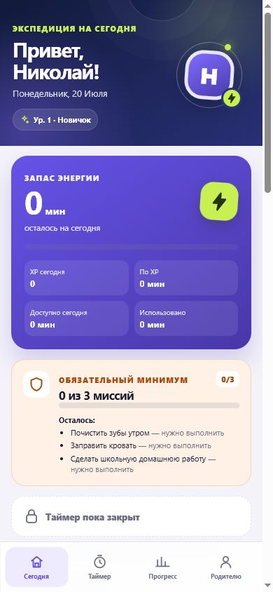

# Миссии Николая

«Миссии Николая» — мобильное семейное PWA для ежедневных заданий и учёта экранного времени. Ребёнок отправляет выполненные миссии на проверку, родитель подтверждает их, а заработанный XP превращается в доступные минуты таймера.

> Production URL после первой публикации: `https://GITHUB_USER.github.io/missions-nikolay/`
>
> `GITHUB_USER` заменяется именем владельца нового репозитория. Имя пользователя не зашито в код.



## Возможности

- ежедневные и пользовательские миссии со статусами «ожидает», «подтверждено» и «отклонено»;
- родительское подтверждение и защита от повторного начисления награды;
- обязательный минимум миссий перед запуском таймера;
- расчёт XP, минут, дневного лимита и переноса остатка;
- восстанавливаемый обратный таймер и досрочная остановка;
- уровни, серия дней, статистика и история;
- родительский режим с PIN, журналом, настройками и ручной корректировкой XP;
- светлая, тёмная и системная темы;
- установка на домашний экран, offline app shell и управляемое обновление service worker;
- адаптивный интерфейс с safe-area для мобильных устройств.

## Технологии

- React 19 и TypeScript;
- Vite 7;
- Vitest;
- ESLint;
- Web App Manifest, Service Worker и `localStorage`;
- GitHub Actions и GitHub Pages.

Сервер, сторонний backend, аналитика, трекеры и внешняя база данных не используются.

## Требования и локальный запуск

- Node.js 24 LTS;
- npm;
- современный Chrome, Edge, Firefox или Safari.

```bash
git clone https://github.com/GITHUB_USER/missions-nikolay.git
cd missions-nikolay
npm ci
npm run dev
```

Vite покажет локальный адрес, обычно `http://localhost:5173`. Для просмотра с телефона в той же сети можно запустить `npm run dev -- --host 0.0.0.0`; полноценная PWA-установка вне `localhost` требует HTTPS.

## Проверки и сборка

```bash
npm run lint
npm run typecheck
npm run test
npm run build
```

Production-сборка создаётся в `dist/`. Скрипт сборки проверяет TypeScript, запускает Vite, формирует идентификатор версии service worker и внедряет точный список production-ресурсов для precache.

Локальная проверка сборки:

```bash
npm run preview
```

Не открывайте `dist/index.html` через `file://`: service worker работает только в безопасном браузерном контексте, например на HTTPS или `localhost`.

Текущий автоматический набор содержит 71 тест: 65 unit/regression и 6 smoke.

## Архитектура

| Область | Расположение | Ответственность |
| --- | --- | --- |
| Интерфейс | `src/components/`, `src/screens/` | экраны ребёнка, таймера, прогресса и родителя |
| Состояние приложения | `src/hooks/useMissionApp.ts` | связывание UI, бизнес-операций и сохранения |
| Бизнес-правила | `src/lib/domain.ts` | задания, XP, минуты, лимиты, уровни и история |
| Таймер и даты | `src/lib/timer.ts`, `src/lib/date.ts` | расчёты по временным меткам и локальным дням |
| Хранилище | `src/lib/storage.ts` | проверка, миграция, backup и сохранение состояния |
| PIN | `src/lib/security.ts` | хеширование и проверка локального PIN |
| PWA | `public/`, `src/lib/pwaUpdate.ts`, `scripts/inject-sw-precache.mjs` | manifest, service worker, update UX и precache |
| Проверки | `src/tests/`, `qa/` | автоматические тесты и материалы ручного QA |

Расчёты наград и лимитов находятся в доменном слое; UI не пересчитывает их самостоятельно.

## GitHub Pages и base path

В `vite.config.ts` используется `base: './'`. Manifest, иконки, service worker, `start_url` и `scope` также используют относительные пути. Поэтому одна сборка работает как в корне домена, так и в подпапке project repository — без имени GitHub-пользователя и без жёстко заданного `/missions/`.

Workflow `.github/workflows/deploy-pages.yml` запускается при push в `main` или вручную. Он последовательно выполняет `npm ci`, lint, typecheck, все тесты и build; публикация `dist/` начинается только после успешного завершения проверок.

После создания репозитория один раз откройте **Settings → Pages** и выберите **Source: GitHub Actions**.

### Повторный деплой

Любой push в `main` запускает новую проверку и публикацию:

```bash
git add <изменённые-файлы>
git commit -m "fix: describe the change"
git push origin main
```

Ручной повторный запуск доступен на вкладке **Actions → Deploy PWA to GitHub Pages → Run workflow**.

## Установка на iPhone или iPad

1. Откройте production URL в Safari.
2. Нажмите «Поделиться».
3. Выберите «На экран Домой».
4. Нажмите «Добавить» и запускайте приложение с новой иконки.

Если пункта нет, откройте страницу непосредственно в Safari, а не во встроенном браузере мессенджера и не в приватной вкладке.

## Установка на Android

1. Откройте production URL в Chrome.
2. Откройте меню `⋮`.
3. Выберите «Установить приложение» или «Добавить на главный экран».
4. Подтвердите установку.

Название команды зависит от версии Android и Chrome. Первая загрузка и установка требуют сети.

## Родительский режим и PIN

Первоначальный семейный PIN для новой установки — **1213**. На первом экране выберите «Настроить родительский режим», войдите с этим PIN и сразу замените его в настройках.

После смены новый PIN не хранится открытым текстом: приложение сохраняет локальный хеш с отдельной случайной солью установки. PIN — только семейный UX-барьер, а не полноценная система безопасности. Пользователь с доступом к данным браузера может очистить или изменить локальное состояние.

Разблокированный родительский режим автоматически блокируется через пять минут бездействия, при уходе с экрана родителя и при сворачивании приложения.

## Данные и очистка

Состояние хранится только в `localStorage` текущего браузера: настройки, задания, статусы, журнал, транзакции наград, таймер и история. Локальная резервная копия помогает восстановиться после повреждения записи, но хранится там же.

Облачной синхронизации нет. Данные не переносятся между браузерами и устройствами. Очистка данных сайта, приватный режим, удаление браузера или сброс устройства могут удалить весь прогресс.

Чтобы начать заново, откройте настройки браузера, найдите данные сайта для production URL и выберите очистку хранилища. Это необратимо удалит прогресс на данном устройстве.

## Обновление приложения

Когда новая версия полностью загружена, приложение показывает сообщение **«Доступно обновление»**.

- Нажмите **«Обновить»**, чтобы активировать новую версию и один раз перезагрузить интерфейс.
- Нажмите **«Позже»**, чтобы закончить текущую работу; обновление можно применить после следующего открытия.
- Если версия не меняется, полностью закройте установленное PWA и откройте снова. Очистку данных сайта используйте только как крайнюю меру: она удалит локальный прогресс.

Пользовательские данные и активный таймер переживают обычное обновление, поскольку хранятся отдельно от кэша приложения.

## Ограничения PWA

1. Приложение **не блокирует телефон физически**. Оно считает время и показывает таймер; для реального ограничения нужны системные средства родительского контроля iOS или Android.
2. Браузер или ОС могут заморозить фоновое PWA, поэтому звук и вибрация в точный момент окончания не гарантированы. После возврата таймер пересчитывается по реальному времени.
3. Без сервера невозможно полностью защититься от изменения системных часов или данных браузера.
4. Offline-режим доступен после первого успешного online-посещения текущей версии.
5. Установка, фоновые ограничения и жизненный цикл отличаются на iOS и Android.
6. Проверка в браузерной эмуляции не заменяет приёмку на физических устройствах.

## QA

Подробный отчёт: [`qa/QA_REPORT.md`](qa/QA_REPORT.md). Проверенные снимки находятся в `qa/screenshots/after/`; они не входят в production bundle.

Перед релизом проверены ширины 320×568, 375×812, 390×844 и 430×932, offline-запуск, обновление service worker и работа из подпапки `/missions/`.
